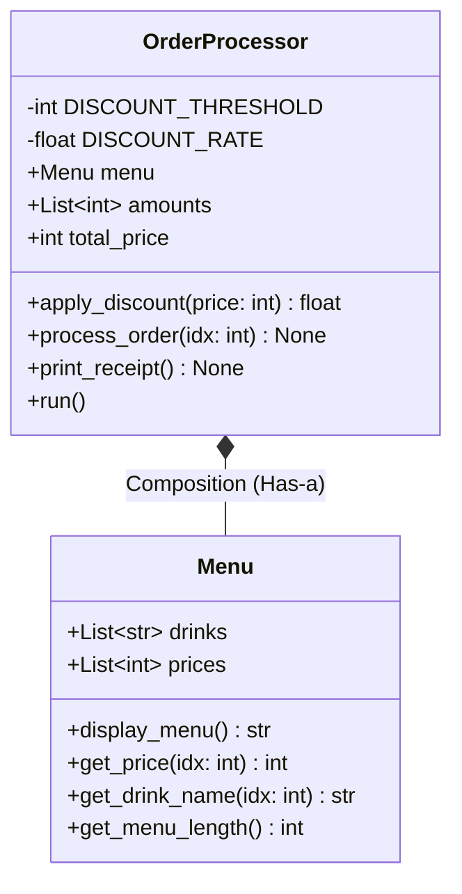

```mermaid
classDiagram
    class Menu {
        +List~str~ drinks
        +List~int~ prices
        +display_menu() str
        +get_price(idx: int) int
        +get_drink_name(idx: int) str
        +get_menu_length() int
    }

    class OrderProcessor {
        -int DISCOUNT_THRESHOLD
        -float DISCOUNT_RATE
        +Menu menu
        +List~int~ amounts
        +int total_price
        +apply_discount(price: int) float
        +process_order(idx: int) None
        +print_receipt() None
        +run()
    }

    OrderProcessor *-- Menu : Composition (Has-a)
```