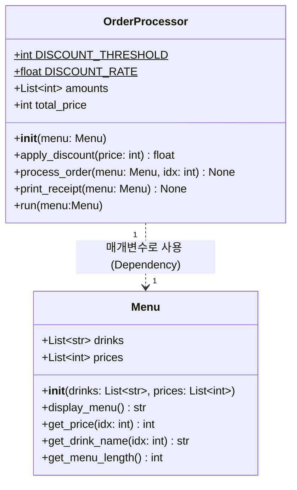

```mermaid
classDiagram
direction TB
    class Menu {
	    +List~str~ drinks
	    +List~int~ prices
	    +__init__(drinks: List~str~, prices: List~int~)
	    +display_menu() str
	    +get_price(idx: int) int
	    +get_drink_name(idx: int) str
	    +get_menu_length() int
    }

    class OrderProcessor {
	    +int DISCOUNT_THRESHOLD$
	    +float DISCOUNT_RATE$
	    +List~int~ amounts
	    +int total_price
	    +__init__(menu: Menu)
	    +apply_discount(price: int) float
	    +process_order(menu: Menu, idx: int) None
	    +print_receipt(menu: Menu) None
	    +run(menu:Menu)
    }

    OrderProcessor "1" ..> "1" Menu : 매개변수로 사용 (Dependency)
```